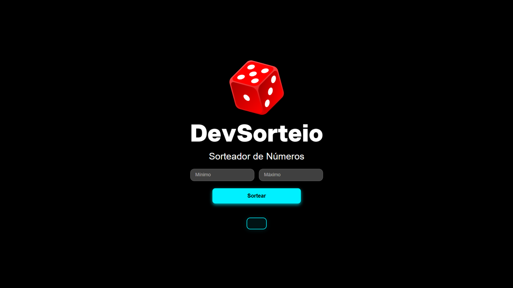

# 📸 Prévia do Projeto
  > 

# 🎲 Sorteador de Números

Este é um sorteador de números simples, desenvolvido com **HTML**, **CSS** e **JavaScript**.  
Ele permite ao usuário definir um intervalo mínimo e máximo e sortear um número aleatório dentro desse intervalo, com visual moderno e interface responsiva.

---

## ✨ Funcionalidades
- Definir valores **mínimo** e **máximo** para o sorteio  
- Botão para gerar um **número aleatório**  
- Interface **responsiva** para desktop, tablet e celular  
- Design **simples** e **intuitivo**  

---

## 📂 Estrutura do Projeto
- 📄 [index.html](https://github.com/alisson-miguelferreira/pagina-login/blob/main/index.html) — Página principal  
- 🎨 [style.css](https://github.com/alisson-miguelferreira/pagina-login/blob/main/style.css) — Estilos do projeto (responsivo)  
- ⚙️ [script.js](https://github.com/alisson-miguelferreira/pagina-login/blob/main/script.js) — Lógica do sorteio  
- 📁 [assets](https://github.com/alisson-miguelferreira/pagina-login/tree/main/assets) — Pasta de imagens  
  - 🖼️ [Sorteador.png](https://github.com/alisson-miguelferreira/pagina-login/blob/main/assets/Sorteador.png) — Print do projeto  
  - 🖼️ [sort 1.png](https://github.com/alisson-miguelferreira/pagina-login/blob/main/assets/sort%201.png) — Imagem utilizada no layout  

---

## 🚀 Como Usar
1. Acesse o projeto pelo link abaixo  
2. Defina os valores **mínimo** e **máximo**.  
3. Clique no botão **"Sortear"** para gerar um número aleatório.  

---

## 🌐 Visualização do Projeto
🔗 [Acesse aqui o projeto ao vivo](https://alisson-miguelferreira.github.io/sorteador/)

---

## 🤝 Conecte-se Comigo
- 🔗 [LinkedIn](https://www.linkedin.com/in/alisson-miguelferreira/)  
- 🐙 [GitHub](https://github.com/alisson-miguelferreira)  

---


## Estrutura do Projeto
```
├── index.html        # Página principal
├── style.css         # Estilos do projeto (responsivo)
├── script.js         # Lógica do sorteio
└── assets/
    └── sort 1.png    # Imagem utilizada no layout
```

## Como usar
1. Abra pelo link <a href="https://alisson-miguelferreira.github.io/pagina-login/">Sorteador</a>
2. Defina os valores mínimo e máximo.
3. Clique no botão "Sortear" para gerar um número aleatório.

---

## 🌐 Visualização do Projeto

Acesse o projeto ao vivo:  
🔗 <a href="https://alisson-miguelferreira.github.io/pagina-login/">Página de Login</a>

---

🤝 Conecte-se comigo
🔗<a href="https://www.linkedin.com/in/alisson-miguelferreira/">LinkedIn</a>
🐙 <a href="https://github.com/alisson-miguelferreira">GitHub</a>

---
